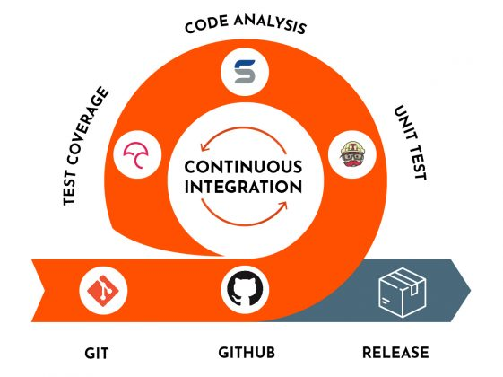
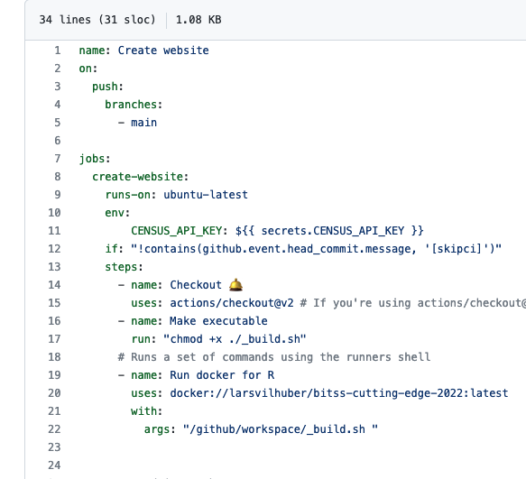
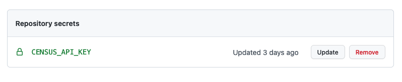
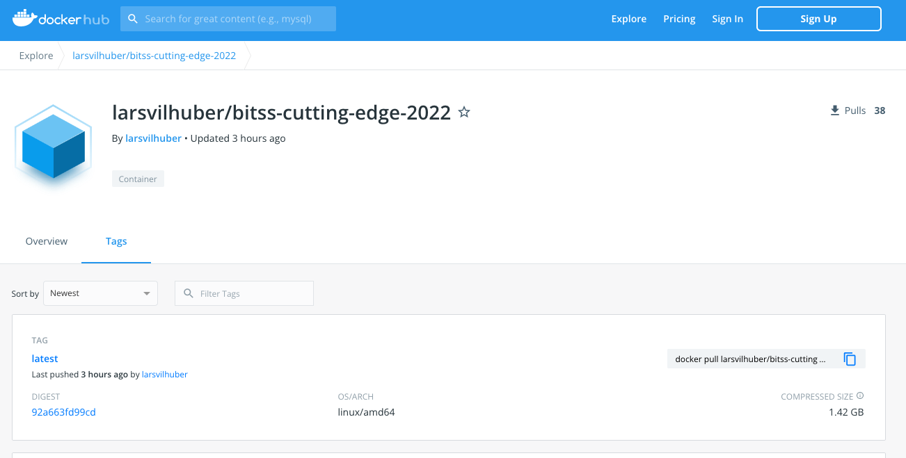

```{r setup, include=FALSE}
# At a minimum, this project environment should have rprojroot - the rest can later be dynamically added if necessary.
knitr::opts_chunk$set(echo = TRUE)
require("rprojroot")
basepath <- rprojroot::find_root(rprojroot::has_file("README.md"))
source(file.path(basepath,"libraries.R"))
```

## Overview

::: {.columns-2}


### Problems with computational reproducibility

- Software changes
- Packages
- Inconsistencies across steps
- Adapting to confidential / big data

### Solutions seldomly used

- Regular/automated recomputations
- Packaging of software as part of the computational artifacts

Along for the ride

- Greater efficiency during project development


:::

# Fine... but: proprietary code!

---


### Proposal: Use open-source software

But:

- Software changes
- Packages
- Inconsistencies across steps
- Adapting to confidential / big data


::: {.bboxc}

None of what follows requires open-source software, nor is invalidated by proprietary software.

:::

With one caveat: **"License rot"**


# OK... but: open-source software has great versioning tools!

---


- [`renv`](https://rstudio.github.io/renv/)
- [`packrat`](https://rstudio.github.io/packrat/)
- Package repositories ([`mran`](https://mran.microsoft.com/timemachine), [Rstudio Public Package Manager](https://packagemanager.rstudio.com/client/#/))


- [`Project.toml` and `Manifest.toml`](https://pkgdocs.julialang.org/v1/toml-files/)

  
## A partial Solution

The various package managers in open source software can be a **partial** solution, when properly implemented. 


- Caveats: availability of packages that are being installed (hosted on Github!)


The discussion here today is *one* way to implement them, which promotes highly reproducible *system* setup to support reproducibility. But it also works for *any* set of software packages, with or without package manager.

::: {.bboxc}

However, it does not *require* any [one of the above] package managers. 

:::

## Illustration: Part of the problem

To make the package managers complete, users need to specify versions of the underlying software as well as of the package.

*Insufficient*

```{r, eval=FALSE}
install.packages("superreg")
```

*Better* but **almost never used**

```{r, eval=FALSE}
remotes::install_version("superreg",version = "1.2.3")
```

## Part of the problem

*Better* but almost **never** used

```{r, eval=FALSE}
if ( R.Version()$major >= 4 & R.Version()$minor >= 0.5 ) { 
remotes::install_version("superreg",version = "1.2.3")
}
```


# Fine... but: proprietary code!

## Everything here also works with proprietary code

- But it can be more complicated
- I will show "easy-to-use" *Stata*
- Works with MATLAB, Intel compilers, Gurobi optimizer,...

# Best practices and Containers

## Imposes some best practices


::: {.columns-2}

### Best practices

- Master script preferred
- No manual copying of results 
- No manual install of packages
- Use platform-neutral path names (`c/myprojects/thisone` instead of `C:\myprojects\thisone`)


### Here 

- Master script *required*
- Results *must* be written out programmatically
- All packages must be installed by scripts*
- Naturally imposes forward-slashes[*](extras.html)


:::


# An example: R with API and big data

## An example: R with API and big data

We will use an example which has the following features: 

- it uses big data, 
- it has one private parameter (an API key) that we do not want to put out there.

How can we get this to be

- robust
- repeatable
- push-button
- in the cloud

## Context

We will use **U.S. Census Bureau data** (American Community Survey data) through an API. Downloading the entire corpus of ACS data would consume multiple **100 GB**, but the API allows us to slice and dice the data. 

The example we will use will artificially reduce the amount of data for illustrative purposes, but we identify how this simple example becomes a "big data" example.

```{block, type="bbox"}
The full example can be found [here](part3.html) ([R source](https://github.com/labordynamicsinstitute/bitss-cutting-edge-2022/blob/main/part3.Rmd)). Refer to it for full requirements and reproducibility setup, as well as how to scale from the toy example to the full setup.
```

```{r install-load-tidycensus,include=FALSE}
pkgTest <- function(x)
{
	if (!require(x,character.only = TRUE))
	{
		install.packages(x,dep=TRUE)
		if(!require(x,character.only = TRUE)) stop("Package not found")
	}
	return("OK")
}
pkgTest("tidycensus")
pkgTest("tidyverse")
```

## Confidential parameters in regular use

Here, we use the `~/.Renviron` file (in my home directory, outside of the project directory), though I won't show you my actual file. Here's what the package documentation says

```{r, eval=FALSE}
census_api_key("111111abc", overwrite = TRUE, install = TRUE)
# First time, reload your environment so you can use the key without restarting R.
readRenviron("~/.Renviron")
# You can check it with:
Sys.getenv("CENSUS_API_KEY")

```

To reproduce this, [obtain a Census API key](http://api.census.gov/data/key_signup.html), and run the code above. We can then set the API key for the `tidycensus` package.

```{r loadkey}
if ( file.exists("~/.Renviron") ) { readRenviron("~/.Renviron") }
census_api_key(Sys.getenv("CENSUS_API_KEY"))
```

## Trivial example

We're going to adapt the "[Basic Usage tutorial](https://walker-data.com/tidycensus/articles/basic-usage.html)" from the `tidycensus` website, and compute the median age by county for 2010 (but for illustration, we'll cut it down).

Let's see this for one county: Tompkins county (FIPS code "36109")
```{r start_timer1,echo=FALSE}
start.time <- Sys.time()
```

```{r median_age_block}
age10block <- get_decennial(geography = "block", state="NY", county="109", 
                            show_call=FALSE,
                       variables = "P013001",year = 2010)
```
```{r end_timer1,echo=FALSE}
time.block <- round(Sys.time() - start.time,digits=2)
```


## Trivial example

That took **`r time.block` seconds**. It generated `r nrow(age10block)` observations. 

For ONE county.  There are *`r nrow(fips_codes)`* counties in total. 


```{r set_up_big}
# Set the number of counties to query
counties.to.query <- 30
# if we wanted all of this, we would replace the number with "nrow(fips_codes)"
# counties.to.query <- nrow(fips_codes)

```

Let's see how long this takes for the first `r counties.to.query` counties.

## Big data {.smaller}

```{r loop_over_counties,cache=TRUE}
# tidycensus/Census API forces to loop over counties
start.time <- Sys.time()
blocks <- NA
for (row in 1:counties.to.query ) {
  county <- fips_codes[row,"county_code"]
  state  <- fips_codes[row,"state"]
  thisblock <- get_decennial(geography = "block",state=state,county=county,
                       variables = "P013001",year = 2010)
  # collect the data
  if ( row == 1 ) {
    blocks <- thisblock
    rm(thisblock)
  } else {
    blocks <- bind_rows(blocks,thisblock)
    rm(thisblock)
  }
}
end.time <- Sys.time()
elapsed.time <- end.time - start.time
elapsed.scale <- round(elapsed.time / counties.to.query * nrow(fips_codes),1)

```

## Big data 

That took **`r round(elapsed.time,2)` seconds** for `r counties.to.query` of `r nrow(fips_codes)` counties, yielding `r nrow(blocks)` records. 

::: {.bbox}

Estimated total time will be approximately  **`r round(elapsed.scale/60,1)`** minutes

:::

# Possible problems

## Possible problems

- API breaks
- Package breaks
- My code breaks

# How to detect problems early?


# Continous Integration




## Continous Integration


```{block, type="bbox"}
Continuous Integration (CI) is the process of automating the build and testing of code every time a team member commits changes to version control. [[*](https://docs.microsoft.com/en-us/devops/develop/what-is-continuous-integration)]
```


## Continous Integration

### Basic principle:

- Write code
- Run code **every time** a change is made
- Detect and adjust problems (tests)

# ... But: Code runs **`r round(elapsed.scale/60,1)`** minutes!

# Relax.


# Setting up cloud computing

## Setting up cloud computing

In this example, 

- Github
- Github Actions
- API key as a `Github Actions Secret`
- Docker container

## What is... {.smaller}

### Github

*Hosted git repository* (could be Gitlab, Bitbucket, others)

### Github Actions: 

Github's "*Continuous Integration*" solution <br />(could be Gitlab CI, Bitbucket Pipelines, Travis CI, others)

### Github Actions Secret 

A private way to *securely store information* (here: the API key) in the cloud, to be used by online solutions such as Github Actions

### Docker

A container solution, underlying much of the current internet <br />
(Github Actions, Netflix, various other solutions)

## Docker

### Docker are (linux) containers

I have [written about Docker in Economics](https://aeadataeditor.github.io/posts/2021-11-16-docker) before. 

```{block, type="bbox"}
Containers are “implementations of operating system-level virtualization,”[^1] typically on Linux... "packages up code and all its dependencies so the application runs quickly and reliably from one computing environment to another."[^2]
```

## Singularity

I'm going to focus on Docker (more common in the commercial world), but there are other implementations, such as [Singularity](https://singularity.hpcng.org/), and a common standard for "container" specifications/structure. 


# Docker in Economics is rare

The use of containers as part of replication packages in economics is **extremely low**. 

For an  excellent introduction, see Boettinger (2015) [^intro].

## Basic principles

**Isolation**: means that 

- in principle all dependencies are handled
- there should be virtually no differences across 
  - time, 
  - users' environment (operating system, system settings)
  - software implementation 
  
in reproducing the outcomes of software.

### Caveat

If your software accesses the internet, then things can change over time.


# Containers and reproducibility

Containers **can** therefore, but **do not necessarily**, contribute to reproducibility and replicability. 

## Containers once created ...

- can (should) reliably reproduce the context and output they were designed to handle. 

### Reproducibility of containers themselves

- typically use a plain-text script for their creation (so-called `Dockerfile`)
  - contributes to transparency. 
  
## Caveats for Reproducibility {.smaller}

### Interactive creation

Containers **can**  be interactively created, or incorporate externally created packages (internet access), and then saved, which may lead to some black-box actions that are not transparent. 

> Thus, containers can generate reproducible output, but not be themselves reproducibly created. 

### Dynamics updates

If containers rely on external resources 

- for instance, accessing the internet to download data from an API, 
- install "latest" packages 

the output generated may not be reproduced, though it may still be considered **replicable.**

```{r,eval=FALSE}
update.packages(ask = FALSE)
```


## Containers in computational social science 

For the (social science) research environment, this should, in principle, handle many of the common problems that workarounds and READMEs list. Uses

- Run R through a container
- Run Intel Fortran (or another complex setup) through container
- Run Gurobi through container with a dynamic license
- The Holy Grail in **Economics**: Run Stata through a container

## Running R, Julia, Python in Docker

Most examples on internet use containers in conjunction with open-source languages: R, Python, Julia, etc. 

# A Really Simple Example with R

## Specifying a container

- `Dockerfile`:

```{docker}
FROM rocker/r-ver:4.0.1
COPY setup.R .
RUN Rscript setup.R
```

That's already all there is to defining a Docker image for a project!

### NOTE

- We leverage an existing image (official [rocker](https://hub.docker.com/u/rocker/) maintaining containers for R)
- Best practice: a `setup.R` script to initialize the environment

## Creating a container {.smaller}

Of course, it now needs to be built:[^4]

```{bash, eval=FALSE}
TAG=v$(date +%F)
MYIMG=bitss-cutting-edge-2022
MYHUBID=larsvilhuber
DOCKER_BUILDKIT=1 docker build . -t $MYHUBID/$MYIMG:$TAG
```


```{bash,eval=FALSE}
[+] Building 4.7s (17/17) FINISHED                                              
 => [internal] load build definition from Dockerfile                       0.0s
 => => transferring dockerfile: 37B                                        0.0s
...
 => exporting to image                                                     0.0s
 => => exporting layers                                                    0.0s
 => => writing image sha256:73cf6ac6b5a8a84f72fff729879b46d14340352761bb1580.0s
 => => naming to docker.io/larsvilhuber/bitss-cutting-edge-2022:2022-02-10 0.0s
```

This locks in our R environment, at the time of building (`$TAG`). It is then straightforward to run the authors' code, reliably, over and over again. 


## Running a container

All we need is Docker as a software installation on our **workstation.** 

```{bash, eval=FALSE}
cd path/to/code
docker run --rm \
   -v $(pwd)/subdir:/code \
   -w /code $MYHUBID/${MYIMG}:$TAG \
   Rscript main.R
```

Or: in the cloud.

## Setting up cloud computing

In this example, 

- Github
- Github Actions
- API key as a `Github Actions Secret`
- Docker container

## Example: this presentation {.smaller}

- **Github**
- **Github Actions**
- API key as a `Github Actions Secret`
- Docker container

[labordynamicsinstitute/bitss-cutting-edge-2022/.../workflows/main.yml](https://github.com/labordynamicsinstitute/bitss-cutting-edge-2022/blob/main/.github/workflows/main.yml)
```{r,echo=FALSE}
#knitr::include_url("https://github.com/labordynamicsinstitute/bitss-cutting-edge-2022/blob/main/.github/workflows/main.yml")
```

[](https://github.com/labordynamicsinstitute/bitss-cutting-edge-2022/blob/main/.github/workflows/main.yml))


## Example: this presentation {.smaller}

- Github
- Github Actions
- **API key as a `Github Actions Secret`** ([how](https://docs.github.com/en/actions/security-guides/encrypted-secrets))
- Docker container




## Example: this presentation {.smaller}

- Github
- Github Actions
- API key as a `Github Actions Secret`
- **Docker container** ([Dockerfile](https://github.com/labordynamicsinstitute/bitss-cutting-edge-2022/blob/main/Dockerfile))




## Running Docker the Easy Way

Of course, this may all seem overwhelming and complicated, as any new piece of software. Which is why several services are available that make this all a lot easier. These include [CodeOcean](https://codeocean.com/), [WholeTale](https://wholetale.org/), [Binder](https://mybinder.org/), and others (see Konkol et al, 2020,[^konkol] for a broader overview). Behind the scenes, these use containers as well, sometimes built on the fly, but also able to archive the containers, ensuring persistence of what hopefully are reproducible containers.

We have started to use these services to enable reproducibility verification in an environment which allows us, when the time inevitably arrives, to share the exact environment with the authors in order to debug code. In contrast with the statement "Author, please use this Docker image to reproduce the issue", the request "Author, please click on this URL to reproduce the issue" is much simpler. Several authors have been offered both options (no RCT...), and have generally preferred the option of an online easy interface to the ability to run Docker or Singularity locally. 

And we have started to leverage the ability to also publish these reproducible artifacts. Recent examples include Rossi (2021)[^rossi] and DellaVigna and Pope (2021)[^stefano]. In both cases, we were able to populate the [CodeOcean](https://doi.org/10.24433/CO.7940775.v1) [capsule](https://doi.org/10.24433/CO.0687784.v1) when we ran into reproducibility issues, sharing it (via a URL) with the authors, and solving the issue that both satisfied the AEA Data Editor, and is likely to satisfy future replicators as well. 

We are working with the [WholeTale](https://wholetale.org/) on similar usage scenarios, and are open to working with authors' choices whereever those may lead.


# Running Docker locally?

Absolutely.

- For publications, it is very important to keep a record of the computational artifacts (see [AEA Data and Code Availability Policy](https://www.aeaweb.org/journals/data/data-code-policy))

# Running code interactively?

Yes. 

- In fact, this presentation is created interactively in the cloud

And yet it **also**

- is run non-interactively in the cloud for each pushed commit ([key configuration line](https://github.com/labordynamicsinstitute/bitss-cutting-edge-2022/blob/867c5c3cc3eb185711744bc2a81827698414a95e/.github/workflows/main.yml#L19) and [example run](https://github.com/labordynamicsinstitute/bitss-cutting-edge-2022/runs/5133378182?check_suite_focus=true))
- can be downloaded (click [here](x-github-client://openRepo/https://github.com/labordynamicsinstitute/bitss-cutting-edge-2022) to open with Github Client) and run locally

```
source .Renviron
docker run  \
   -e CENSUS_API_KEY=$CENSUS_API_KEY \
   -v "$(pwd)":/home/rstudio \
   --rm  \
   larsvilhuber/bitss-cutting-edge-2022 \
   Rscript _build.R
```


# References

--


[^1]: Wikipedia. 2021. "List of Linux containers." [wikipedia.org/wiki/List_of_Linux_containers](hhttps://en.wikipedia.org/w/index.php?title=List_of_Linux_containers&oldid=1015376890), accessed on 2021-07-07.

[^2]: Docker.com. 2021. "What is a Container." [docker.com/resources/what-container](https://web.archive.org/web/20210609145942/https://www.docker.com/resources/what-container), accessed on 2021-07-07.

[^4]: For additional steps, and complete instructions, see [github.com/AEADataEditor/docker-r-starter](https://github.com/AEADataEditor/docker-r-starter)

[^intro]: Boettiger, Carl. “An Introduction to Docker for Reproducible Research.” ACM SIGOPS Operating Systems Review 49, no. 1 (January 20, 2015): 71–79. [https://doi.org/10.1145/2723872.2723882](https://doi.org/10.1145/2723872.2723882).

[^lms]: Lamadon, Thibaut, Magne Mogstad, and Bradley Setzler. forthcoming. "[Imperfect Competition, Compensating Differentials and Rent Sharing in the U.S. Labor Market.](https://www.aeaweb.org/articles?id=10.1257/aer.20190790)" *American Economic Review* with [Github repository](https://github.com/setzler/LMS) and [1](https://doi.org/10.24433/CO.7147919.v1) [2](https://doi.org/10.24433/CO.3047157.v1) [3](https://doi.org/10.24433/CO.4775581.v1) [4](https://doi.org/10.24433/CO.3648033.v1) compute capsules.


[^rossi]:  Rossi, Barbara. 2021. "Compute Capsule for: Forecasting in the presence of instabilities: How do we know whether models predict [Source Code]." *CodeOcean*. https://doi.org/10.24433/CO.7940775.v1, which accompanies a forthcoming article in the Journal of Economic Literature, and which is also archived in the more traditional location as Rossi, Barbara. 2021. "Data and Code for: Forecasting in the Presence of Instabilities." *American Economic Association* [publisher], *Inter-university Consortium for Political and Social Research* [distributor]. https://doi.org/10.3886/E147225V1

[^stefano]: DellaVigna, Stefano and Devin Pope. 2021. "Compute Capsule for: Stability of Experimental Results: Forecasts and Evidence" [Source Code]. *CodeOcean*. https://doi.org/10.24433/CO.0687784.v1, which accompanies a [forthcoming article in American Economic Journal: Microeconomics](https://www.aeaweb.org/articles?id=10.1257/mic.20200129), and which is also archived in the more traditional location as DellaVigna, Stefano, and Devin Pope. 2021. "Data and Code for: Stability of Experimental Results: Forecasts and Evidence." *American Economic Association* [publisher], *Inter-university Consortium for Political and Social Research* [distributor]. https://doi.org/10.3886/E135221V1

