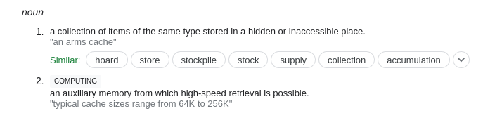

```{r setup, include=FALSE}
# At a minimum, this project environment should have rprojroot - the rest can later be dynamically added if necessary.
knitr::opts_chunk$set(echo = TRUE)
require("rprojroot")
basepath <- rprojroot::find_root(rprojroot::has_file("README.md"))
source(file.path(basepath,"libraries.R"))
```

## Overview

::: {.columns-2}


### Problems with computational reproducibility

- Software changes
- Packages
- Inconsistencies across steps
- Adapting to confidential / big data

### Solutions seldomly used

- Regular/automated recomputations
- Packaging of software as part of the computational artifacts

Along for the ride

- Greater efficiency during project development


:::

# Fine... but: proprietary code!

---


### Proposal: Use open-source software

But:

- Software changes
- Packages
- Inconsistencies across steps
- Adapting to confidential / big data


None of what follows requires open-source software, nor is invalidated by proprietary software.

With one caveat: **"License rot"**


# OK... but: open-source software has great versioning tools!

---


- [`renv`](https://rstudio.github.io/renv/)
- [`packrat`](https://rstudio.github.io/packrat/)
- Package repositories ([`mran`](https://mran.microsoft.com/timemachine), [Rstudio Public Package Manager](https://packagemanager.rstudio.com/client/#/))

---


- [`Project.toml` and `Manifest.toml`](https://pkgdocs.julialang.org/v1/toml-files/)

  
## A partial Solution

The various package managers in open source software can be a **partial** solution, when properly implemented. 


- Caveats: availability of packages that are being installed (hosted on Github!)


The discussion here today is *one* way to implement them, which promotes highly reproducible *system* setup to support reproducibility. But it also works for *any* set of software packages, with or without package manager.

However, it does not *require* any one of the above package managers. 

## Part of the problem

To make the package managers complete, users need to specify versions of the underlying software as well as of the package.

*Insufficient*

```{r, eval=FALSE}
install.packages("superreg")
```

*Better* but **almost never used**

```{r, eval=FALSE}
remotes::install_version("superreg",version = "1.2.3")
```

## Part of the problem

*Better* but **never** used

```{r, eval=FALSE}
if ( R.Version()$major >= 4 & R.Version()$minor >= 0.5 ) { 
remotes::install_version("superreg",version = "1.2.3")
}
```

> Hardly ever seen...

# Fine... but: proprietary code!

## Everything here also works with proprietary code

- But it can be more complicated
- I will show "easy-to-use" *Stata*

# Part 1 | Ideal structure

## Imposes some best practices


::: {.columns-2}

### Best practices

- Master script preferred
- No manual copying of results 
- No manual install of packages
- Use platform-neutral path names (`c/myprojects/thisone` instead of `C:\myprojects\thisone`)


### Here 

- Master script *required*
- Results *must* be written out programmatically
- All packages must be installed by scripts*
- Naturally imposes forward-slashes[*](extras.html)


:::


# An example: R with API and big data

## An example: R with API and big data

We will use an example which has the following features: it uses big data, and it has one private parameter (an API key) that we do not want to put out there.

We're then going to add a complication: We want to run a downstream part in Stata.

How can we get this to be

- robust
- repeatable
- push-button
- in the cloud

## Context

We will use **U.S. Census Bureau data** (American Community Survey data) through an API. Downloading the entire corpus of ACS data would consume multiple **100 GB**, but the API allows us to slice and dice the data. 

The example we will use will artificially reduce the amount of data for illustrative purposes, but we identify how this simple example becomes a "big data" example.

```{block, type="bbox"}
The full example can be found [here](part3.html) ([R source](https://github.com/labordynamicsinstitute/bitss-cutting-edge-2022/blob/main/part3.Rmd)). Refer to it for full requirements and reproducibility setup, as well as how to scale from the toy example to the full setup.
```

```{r install-load-tidycensus,include=FALSE}
pkgTest <- function(x)
{
	if (!require(x,character.only = TRUE))
	{
		install.packages(x,dep=TRUE)
		if(!require(x,character.only = TRUE)) stop("Package not found")
	}
	return("OK")
}
pkgTest("tidycensus")
pkgTest("tidyverse")
```

## Confidential parameters

Here, we use the `~/.Renviron` file (in my home directory, outside of the project directory), though I won't show you my actual file. Here's what the package documentation says

```{r, eval=FALSE}
census_api_key("111111abc", overwrite = TRUE, install = TRUE)
# First time, reload your environment so you can use the key without restarting R.
readRenviron("~/.Renviron")
# You can check it with:
Sys.getenv("CENSUS_API_KEY")

```

To reproduce this, [obtain a Census API key](http://api.census.gov/data/key_signup.html), and run the code above. We can then set the API key for the `tidycensus` package.

```{r loadkey}
if ( file.exists("~/.Renviron") ) { readRenviron("~/.Renviron") }
census_api_key(Sys.getenv("CENSUS_API_KEY"))
```

## Trivial example

We're going to adapt the "[Basic Usage tutorial](https://walker-data.com/tidycensus/articles/basic-usage.html) from the `tidycensus` website, and compute the median age by county for 2010 (but for illustration, we'll cut it down).

Let's see this for one county: Tompkins county (FIPS code "36109")

```{r median_age_block}
start.time <- Sys.time()
age10block <- get_decennial(geography = "block", state="NY", county="109", show_call=FALSE,
                       variables = "P013001",year = 2010)
time.block <- round(Sys.time() - start.time,digits=2)
```

## Trivial example

That took **`r time.block` seconds**. It generated `r nrow(age10block)` observations. 

For ONE county.  There are *`r nrow(fips_codes)`* counties in total. 


```{r set_up_big}
# prepare the next block
counties.to.query <- 30
# if we wanted all of this, we would replace the number with "nrow(fips_codes)"
# counties.to.query <- nrow(fips_codes)

```

Let's see how long this takes for the first `r counties.to.query` counties.

## Big data {.smaller}

```{r loop_over_counties,cache=TRUE}
# tidycensus/Census API forces to loop over counties
start.time <- Sys.time()
blocks <- NA
for (row in 1:counties.to.query ) {
  county <- fips_codes[row,"county_code"]
  state  <- fips_codes[row,"state"]
  thisblock <- get_decennial(geography = "block",
                             state=state,
                             county=county,
                       variables = "P013001",
                       year = 2010)
  if ( row == 1 ) {
    blocks <- thisblock
    rm(thisblock)
  } else {
    blocks <- bind_rows(blocks,thisblock)
    rm(thisblock)
  }
}
end.time <- Sys.time()
elapsed.time <- end.time - start.time
elapsed.scale <- round(elapsed.time / counties.to.query * nrow(fips_codes),1)

```

## Big data 

That took **`r round(elapsed.time,2)` seconds** for `r counties.to.query` of `r nrow(fips_codes)` counties, yielding `r nrow(blocks)` records. 

Total time will be approximately  **`r round(elapsed.scale/60,1)`** minutes

Would you want to incur that time every time you run the code for the entire country?

# Solution 1

## Solution 1: sampling

We already implemented the first solution, which is useful while you are developing this:

- we reduced the number down to a feasible number (**`r counties.to.query`** counties)
- estimated the total runtime (**`r round(elapsed.scale/60,1)`** minutes) 

Ideally, we would use two values for the parameter to control this: a really small number to test code for functionality, and a larger number to get some meaningful results. 


For the final run, we would set it to run on the full scope of the problem.

# Solution 2

## Solution 2: Intermediate files

The second solution is to break the problem apart. Let's see how long it takes to save and to read the resulting file. First, let's be clear about the directory structure here:

```{r setup_dirs}
basedata <- file.path(basepath,"data")
rawdata  <- file.path(basedata,"raw")
cache    <- file.path(basedata,"cache")
generated<- file.path(basedata,"generated")
```

---

We've defined three directories: 

- `basedata` to house all the data
- `rawdata` to house any data we may have (manually) downloaded from somewhere else
- `cache` to house intermediate data which can be programmatically downloaded, but maybe need a temporary home
- `generated` to house any data we generate by modifying either `rawdata` or `cache` data.


## Documentation!

Our README should describe this, and could also specify that all data in `cache` and `generated` can be recreated, given enough time.

We're going to use the cache to speed up processing for subsequent runs during testing and possibly for demonstration purposes.

## What is a cache?



## Reproducibility again {.smaller}

Let's make sure these directories exist:

```{r}
for ( dir in list(basedata,rawdata,cache,generated) ) {
  if (file.exists(dir)) {
    message(paste0("Directory ",dir," already present!"))
  } else {
    dir.create(file.path(dir),recursive=TRUE)
    message(paste0("Directory ",dir," created!"))
  }
}
```

Those steps would normally go into the header of our reproducible document!

## Timing

Let's move to the timing:

```{r saveread}
system.time(saveRDS(blocks,file = file.path(cache,"block_median.Rds")))
rm(blocks)
start.time <- Sys.time()
blocks <- readRDS(file=file.path(cache,"block_median.Rds"))
read.time <- Sys.time() - start.time
read.scaled <- read.time / counties.to.query * nrow(fips_codes)
```

Assuming that scaling up to the full filesize is linear, it would take **`r round(read.scaled,2)` seconds** to read back the entire universe of blocks from a cached file, compared to **`r round(elapsed.scale,2)` seconds** for using the API each time. 

## Refinements

How could this be even more refined? For one, we could test whether the cache file has already been generated in the download section:

```{r cache,eval=FALSE}
# not evaluated
cache.blocks <- file.path(cache,"block_median.Rds")

if ( file.exists(cache.blocks)) {
  blocks <- readRDS(cache.blocks)
} else {
  readin_from_api(outfile=cache.blocks)
}
```

---

Now we can routinely process this, without having to worry about that pesky download part.^[Note that Rmarkdown allows to define a section as cached as well. However, that cache is automatically invalidated when any code or text above it is modified, leading to potentially undesireable re-downloads. In this case, it may be better to work with a manually defined cache.]

## Generalizing

Note that the above works for any kind of programming language (Stata, SPSS, etc.). It also works and should be used for any large-ish files, and may percolate through an entire job stream.

## Robustness

So what happens when the API (inevitably) changes, breaks, is shut down, or otherwise stops working? 

> **Nothing.**

Because we have the cached file, we are safe from such breaks in the API. In fact, when providing our replication package, we should (if allowed by license) provide the cached file, yet not remove the part about downloading it. 

# Quick Summary

## Tips and Tricks

- Have the ability to test your code
  - Build tests into your code
- Use intermediate files / split your processing into pieces
- Check for intermediate files.

```{r,eval=FALSE}
# R:
if ( ! file.exists(file.path(intermediate,”step1.Rdata”)) {
    prepare_file(in=“step0”,out=“step1”,outpath=intermediate)
} else {
   message(“File exists, skipping processing”)
}
```
```{stata,eval=FALSE}
/* Stata */
capture confirm file “$intermediate/step1.dta"
  if _rc!=0 {
    process_file step0 step2 $intermediate
}  else {
    display " File exists, skipping processing "
  }
```

## Tips and Tricks 2

### Cleanly separate Confidential data and public use data

- You are going to have to provide copies of the public use data without compromising confidentiality

### Cleanly separate Confidential parameters and the rest of the code

- Reduces need to redact programs

## Tips and Tricks 3

**Cleanly separate and preserve**

- Data acquisition code
  - Or instructions, needs to be re-executable
- Confidential parameters and the rest of the code
  - Reduces need to redact programs
  - API keys and the like
- Intermediate data extracts
  - When its impossible to exactly re-extract data
  - When data extract takes a long time

# Exercise 3

## Exercise 3-1

```{r sysinfo,include=FALSE}
mysysinfo <- try(system("cat /proc/cpuinfo | grep 'model name' | tail -1 | awk -F: '{ print $2 } '",intern=TRUE))
```

<div class="blue3">

Run this whole document on your own computer or in the cloud!

- This was run on a `r mysysinfo`, and  took **`r round(elapsed.time,2)` seconds** for `r counties.to.query` counties. 
- How long does it take to run on yours?
- Clone this repository: [labordynamicsinstitute/reproducibility-confidential](https://github.com/labordynamicsinstitute/reproducibility-confidential)
- Open the `part3.Rmd` document, and `knit`.

Do you understand the various parts?

What is the connection with confidential data?

</div>

